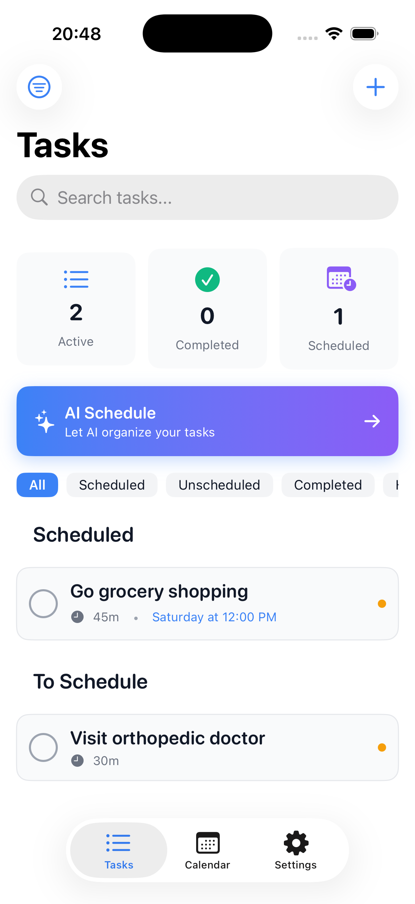
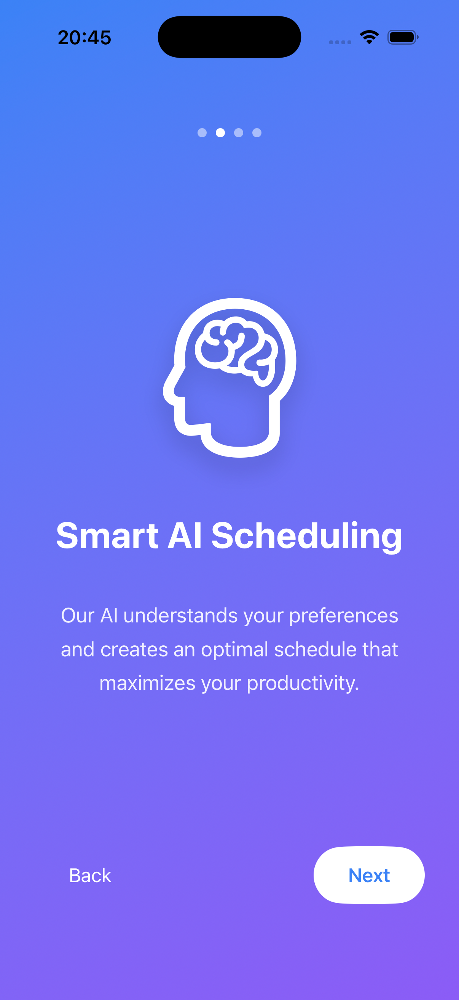
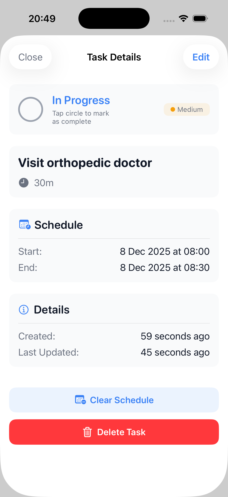
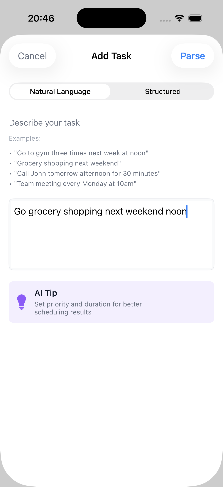
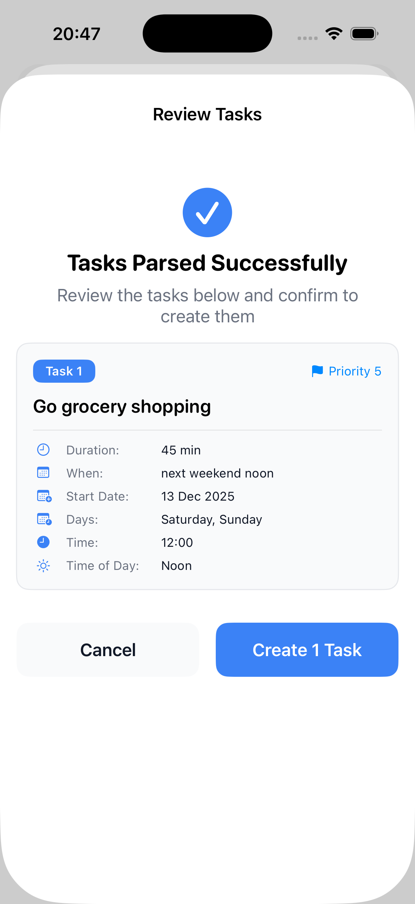
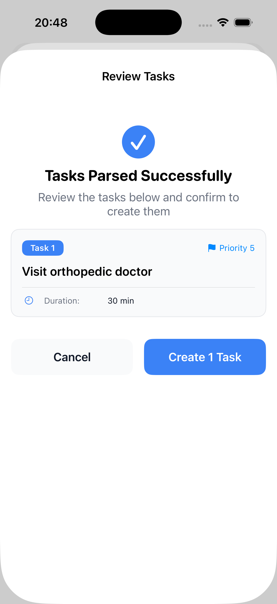
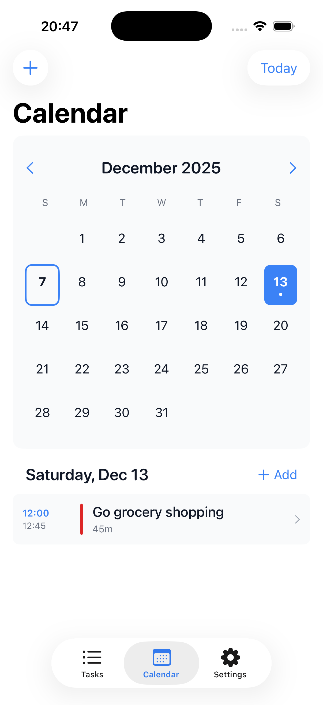
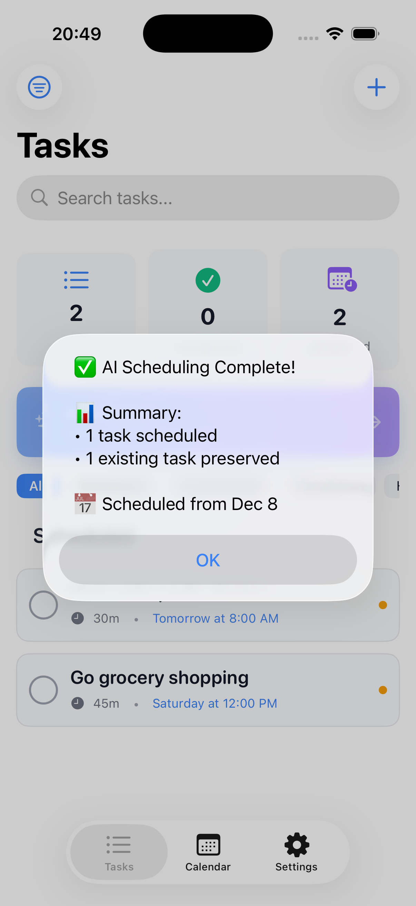
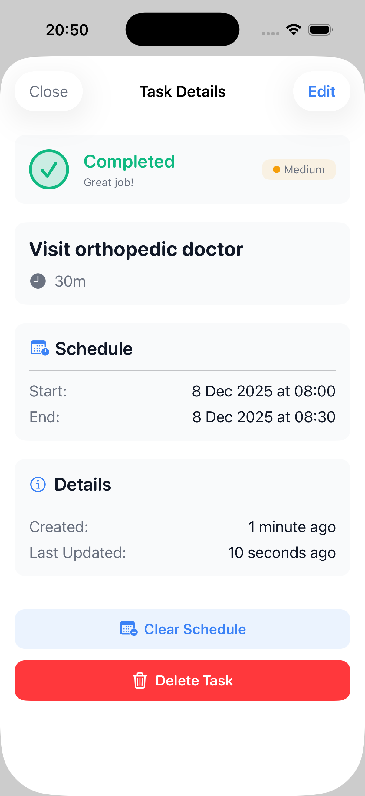

# AI Scheduler

An intelligent iOS task scheduling application powered by OpenAI GPT-4o that transforms natural language into optimally scheduled tasks with smart temporal constraint handling.

<div align="center">
  
  
  
</div>

## 📖 Overview

AI Scheduler is a SwiftUI-based iOS application that combines natural language processing with intelligent task scheduling. Simply describe your tasks in plain English like "I wish I go to gym three times a week next week at noon" or "grocery shopping next weekend", and the AI will parse your intent, extract all relevant details, and create perfectly scheduled tasks that respect your temporal constraints.

## ✨ Key Features

### 🗣️ Natural Language Processing
- **Intelligent Task Parsing**: Describe tasks naturally without filling forms
- **Temporal Understanding**: Recognizes "next weekend", "tomorrow", "weekdays", "at noon", etc.
- **Smart Duration Inference**: Automatically estimates task duration based on context (gym → 60min, meeting → 30min)
- **Priority Detection**: Identifies urgency from keywords like "urgent", "important", "when I can"
- **Multiple Task Creation**: Automatically creates separate instances for recurring patterns

<div align="center">
  
  
  
</div>

### 📅 Advanced Temporal Constraints
The app understands and respects complex time-based rules:
- **Weekend/Weekday Constraints**: "next weekend" schedules only on Saturday/Sunday
- **Specific Day Preferences**: "every Monday" creates recurring Monday tasks
- **Time-of-Day Preferences**: "morning", "noon", "afternoon", "evening"
- **Date Ranges**: "next week" calculates actual Monday-Sunday dates
- **Fixed Time Slots**: Tasks with specific dates/times are locked and won't be moved

### 🤖 AI-Powered Scheduling
- **OpenAI GPT-4o Integration**: Uses advanced language models for both parsing and scheduling
- **Smart Task Placement**: Optimizes schedule based on priorities, duration, and constraints
- **Context-Aware**: Considers task descriptions to group similar activities
- **Conflict Avoidance**: Never overlaps tasks, respects work hours
- **Buffer Time Management**: Adds transition time between tasks

<div align="center">
  
  
  
</div>

### 📊 Dual Input Modes
1. **Natural Language Mode** (Default)
   - Text-based input with examples
   - Real-time AI parsing
   - Visual review screen showing extracted details
   - Displays calculated dates and constraints

2. **Structured Mode**
   - Traditional form-based input
   - Manual duration/priority/recurrence selection
   - Direct control over all parameters

### 📱 Rich User Interface
- **Onboarding Flow**: Smooth introduction to app features
- **Task List View**: See all tasks with status indicators
- **Calendar Integration**: Visual calendar view of scheduled tasks
- **Task Details**: Comprehensive single task view with all metadata
- **Completion Tracking**: Mark tasks as done with visual feedback

## 🏗️ Technical Architecture

### Technology Stack
- **Platform**: iOS (SwiftUI)
- **Data Persistence**: SwiftData
- **AI Models**: OpenAI GPT-4o
- **Language**: Swift 5.9+
- **Minimum iOS**: 17.0+

### Core Components

#### 1. Natural Language Processing Layer
**`NLPParserService.swift`**
- Sends user input to OpenAI GPT-4o
- Extracts structured task attributes (title, duration, priority, constraints)
- Calculates actual dates from relative references ("next weekend" → ISO8601 dates)
- Returns confidence scores and clarification requests

#### 2. Temporal Date Calculator
**`TemporalDateCalculator.swift`**
- Fallback system for date calculations
- Handles edge cases (weekends, holidays, specific days)
- Ensures consistent date interpretation
- Supports complex recurrence patterns

#### 3. AI Scheduler Service
**`OpenAISchedulerService.swift`**
- Optimizes task placement using GPT-4o
- Respects all temporal constraints and fixed time slots
- Considers task descriptions for intelligent grouping
- Returns scheduled slots with conflict resolution

#### 4. Data Models
**Domain Models:**
- `TaskItem`: SwiftData model for local persistence
- `TaskDTO`: Data transfer object for API communication
- `ParsedTaskAttributes`: Structured NLP output
- `TemporalConstraints`: Time-based rules

**API Models:**
- `SchedulerRequest`: Input to scheduling AI
- `SchedulerResponse`: AI scheduling output
- `ScheduledSlot`: Individual task placement

## 🔄 How It Works

### Natural Language Flow

```
1. User Input
   "go to gym three times next week at noon"
   ↓
2. NLP Parser (GPT-4o)
   Extracts:
   - Title: "Go to gym"
   - Duration: 60 minutes (inferred)
   - Priority: 5 (normal)
   - Recurrence: 3 times
   - Temporal: Next Monday-Sunday, 12:00 PM
   ↓
3. Date Calculator
   Calculates actual dates:
   - Next Monday: 2025-12-09
   - Next Sunday: 2025-12-15
   ↓
4. Task Creation
   Creates 3 separate tasks:
   - "Go to gym (1/3)"
   - "Go to gym (2/3)"
   - "Go to gym (3/3)"
   Each with temporal constraints
   ↓
5. AI Scheduler (GPT-4o)
   Optimally places tasks:
   - Monday 12:00 PM
   - Wednesday 12:00 PM
   - Friday 12:00 PM
   ↓
6. Calendar Display
   Visual representation of scheduled week
```

### Scheduling Algorithm

The AI scheduler follows these priorities:
1. **Fixed Time Slots**: Never moved (highest priority)
2. **High Priority Tasks**: Scheduled first
3. **Temporal Constraints**: Weekend/weekday/time-of-day rules
4. **Duration Matching**: Fits tasks into available slots
5. **Task Grouping**: Groups similar tasks when possible
6. **Buffer Time**: Adds transition periods

## 🎯 Use Cases

### Fitness & Health
```
"Workout at the gym 3 times next week in the morning"
→ Creates 3 gym sessions distributed Mon/Wed/Fri at 7 AM
```

### Errands & Shopping
```
"Grocery shopping next weekend"
→ Schedules on Saturday or Sunday only
```

### Work & Meetings
```
"Team standup every weekday at 9am for 15 minutes"
→ Creates Mon-Fri recurring 9 AM meetings
```

### Personal Tasks
```
"Call mom tomorrow afternoon"
→ Schedules between 12 PM - 5 PM tomorrow
```

## 🚀 Future Improvements

### High Priority Enhancements

#### 🎤 Voice Recognition
- **Immediate Task Creation**: Speak tasks instead of typing
- **Siri Shortcuts Integration**: "Hey Siri, schedule gym for tomorrow"
- **Hands-Free Mode**: Voice confirmation and editing
- **Speech-to-Text**: Real-time transcription with NLP parsing

#### ☁️ Cloud Sync & Multi-Device Support
- **iCloud Integration**: Sync tasks across iPhone, iPad, Mac
- **Real-Time Updates**: Changes propagate instantly
- **Conflict Resolution**: Smart merging of simultaneous edits
- **Backup & Restore**: Automatic cloud backups

#### 📧 Gmail & Calendar Integration
- **Google Calendar Sync**: Two-way sync with Google Calendar
- **Email Parsing**: Extract tasks from Gmail messages
- **Meeting Invites**: Auto-create tasks from calendar invites
- **Smart Notifications**: Email reminders for upcoming tasks
- **Requires**: Backend service for OAuth & API integration

#### 🔔 Smart Notifications
- **Time-Based Reminders**: Alerts before task start time
- **Location-Based Triggers**: Notify when near task location
- **Adaptive Scheduling**: Suggest rescheduling if running late
- **Completion Prompts**: Ask if task is done at scheduled end time

#### 🤝 Collaboration Features
- **Shared Tasks**: Collaborate with family/team members
- **Task Assignment**: Delegate tasks to others
- **Progress Tracking**: See team completion status
- **Comments & Notes**: Discussion threads per task

#### 📊 Analytics & Insights
- **Productivity Metrics**: Track completion rates, time spent
- **Pattern Recognition**: Identify optimal work times
- **Habit Formation**: Suggest routine improvements
- **Weekly Reports**: Summary of accomplishments

#### 🎨 Customization
- **Theme Support**: Light/dark/custom color schemes
- **Widget Support**: Home screen & Lock screen widgets
- **Custom Categories**: Tag tasks by project/context
- **Template Library**: Pre-built task templates

#### 🧠 Advanced AI Features
- **Learning from History**: AI learns your scheduling preferences
- **Proactive Suggestions**: "You usually exercise on Tuesdays"
- **Energy Level Optimization**: Schedule hard tasks when you're most alert
- **Deadline Prediction**: Estimate realistic completion times
- **Multi-Language Support**: Parse tasks in different languages

#### 🔗 Third-Party Integrations
- **Todoist/Trello Sync**: Import from existing task managers
- **Fitness App Integration**: Sync with Apple Health, Strava
- **Slack/Teams**: Create tasks from chat messages
- **Zapier/IFTTT**: Automation workflows

#### 🔒 Privacy & Security
- **End-to-End Encryption**: Secure task data
- **Local Processing Option**: Offline NLP parsing
- **Privacy Mode**: Disable cloud features entirely
- **Biometric Authentication**: Face ID/Touch ID lock

### Technical Improvements

#### Backend Infrastructure
```
- REST API for multi-device sync
- PostgreSQL database for user data
- Redis for caching and real-time updates
- OAuth 2.0 for third-party integrations
- WebSocket for real-time collaboration
```

#### Machine Learning Enhancements
```
- On-device Core ML models for faster parsing
- Personalized scheduling preferences
- Predictive task duration estimation
- Context-aware smart suggestions
```

#### Performance Optimizations
```
- Lazy loading for large task lists
- Background scheduling refresh
- Optimistic UI updates
- Request batching and caching
```

## 📄 License

Copyright © 2025 Arlan Kalin. All rights reserved.

## 🙏 Acknowledgments

- **OpenAI**: GPT-4o API for natural language processing and intelligent scheduling
- **Apple**: SwiftUI and SwiftData frameworks
- **Community**: Open source Swift ecosystem

---

**Built with ❤️ using SwiftUI and AI**

For questions or feedback, please open an issue on the repository.
